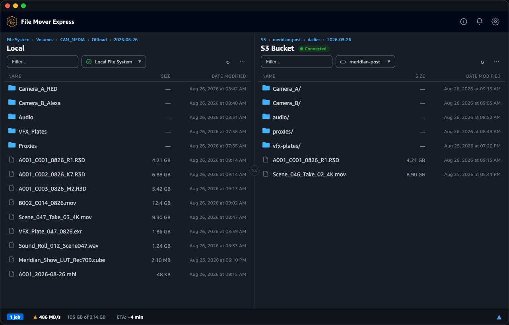
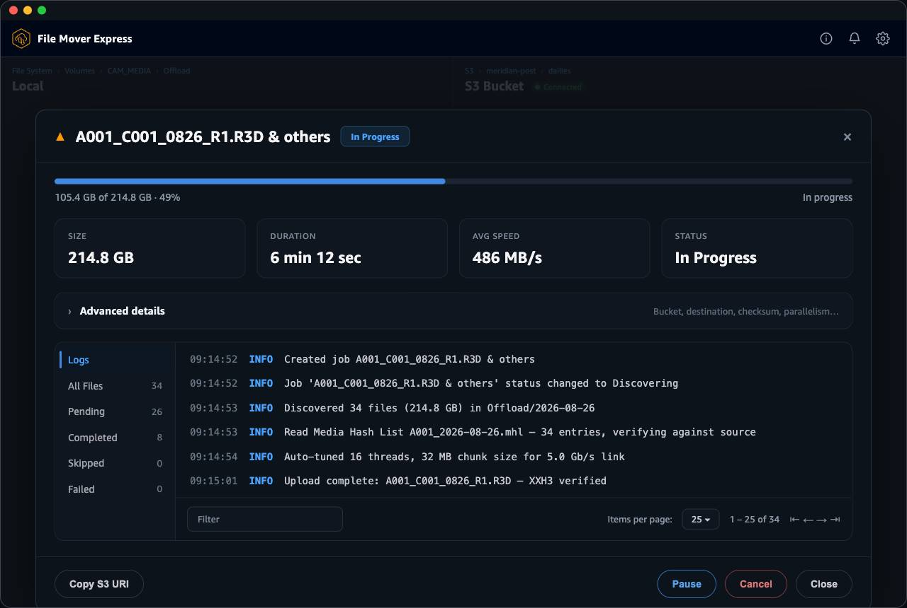
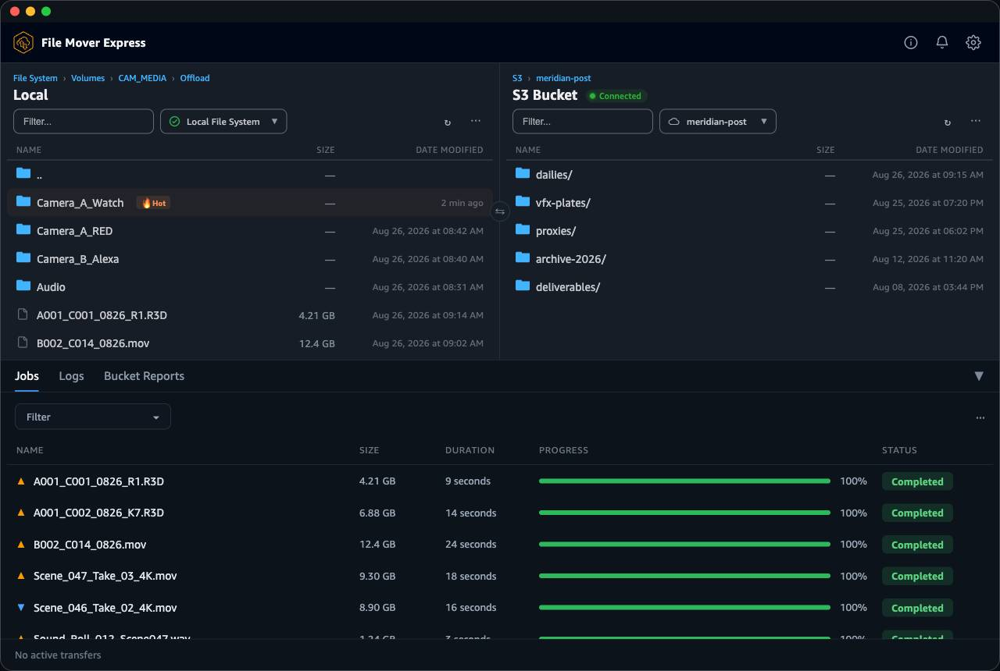
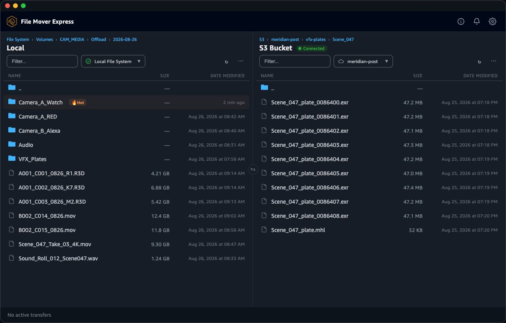

# File Mover Express for AWS

[](https://opensource.org/licenses/Apache-2.0)
[](https://golang.org/)
[](https://nodejs.org/)

File Mover Express is a high-performance file transfer application designed to accelerate media asset workflows between local systems and Amazon S3. Unlike traditional transfer clients that tie transfers to your desktop session, File Mover Express runs a daemon-based transfer engine that can live on any machine — your workstation, a server in the data center, or an EC2 instance — while you control it from the GUI or CLI over an encrypted connection. Built for digital imaging technicians and content creators, it provides both command-line and graphical interfaces for efficient, reliable file transfers.



## Key Features

- **High-Performance Transfers**: Auto-tuned parallel processing using native S3 APIs — your files go directly to S3 with no intermediary servers
- **Multipart Upload Optimization**: Large files are automatically split into chunks and uploaded in parallel, with configurable retry on failures and the ability to pause and resume active transfers
- **Drag & Drop GUI**: A simple graphical interface — drag files in, choose your S3 destination, and go
- **Command-Line Interface**: Full CLI for scripting, automation, and headless environments
- **Hot Folders**: Point File Mover Express at a folder and it will automatically upload anything new that appears in it
- **Secure**: All transfers use HTTPS, and AWS IAM controls who can access your S3 buckets
- **Remote Daemon**: Run File Mover Express on one machine and control it from another over an encrypted connection, protected by a password you set
- **AI Assistant Integration (MCP)**: Built-in [Model Context Protocol](https://modelcontextprotocol.io/) server lets you control transfers through natural language with Claude Desktop, Kiro, Cursor, or any MCP-compatible AI assistant — browse S3, start uploads/downloads, and manage jobs conversationally
- **Checksumming & MHL Support**: Optional file integrity verification, with XXH3 being the fastest option. XXHash, XXHash64 and MD5 are available for workflows that require them. Reads MHL files for camera-to-cloud verification workflows.
- **Cross-Platform**: Works on macOS, Windows, and Linux
- **Multi-Region**: Works with any AWS region where S3 is available

## Screenshots

<table>
  <tr>
    <td width="50%"><br><sub><b>Live transfer</b> — auto-tuned parallel upload of a camera offload, with a running throughput/ETA summary.</sub></td>
    <td width="50%"><br><sub><b>Job details</b> — per-file progress and logs; a camera MHL is honored and every file is XXH3-verified.</sub></td>
  </tr>
  <tr>
    <td width="50%"><br><sub><b>Transfer queue</b> — completed uploads and downloads, with a hot folder auto-ingesting new media.</sub></td>
    <td width="50%"><br><sub><b>Browse S3</b> — dual-pane local ↔ S3 browser navigating a VFX plate (EXR) sequence.</sub></td>
  </tr>
</table>

> Screens show an illustrative media-and-entertainment workflow with sample data.

## Quick Start

### Step 1 — Install File Mover Express

**Download a pre-built installer** from the [Releases page](https://github.com/awslabs/filemoverexpress/releases) and double-click to install.

> macOS releases are signed with Amazon's Apple Developer ID (Team ID `94KV3E626L`, AMZN Mobile
> LLC) and notarized, so they open without a Gatekeeper workaround. Windows installers are
> Authenticode-signed as "Amazon Web Services, Inc."; SmartScreen may still warn until the
> certificate builds reputation — click "More info" then "Run anyway" if so. Since anyone could
> self-sign an app by this name, see [Verifying the signature](https://awslabs.github.io/filemoverexpress/docs/Installation#verifying-the-signature)
> to confirm a download is really Amazon's (and how to clear the quarantine flag on older unsigned
> or self-built apps).

Prefer to build from source? See [Building from Source](https://awslabs.github.io/filemoverexpress/docs/Installation).

---

### Step 2 — Set up AWS

Before you can transfer files, you need an S3 bucket and AWS credentials.

1. **Create an S3 bucket** if you don't have one — see the [Amazon S3 User Guide](https://docs.aws.amazon.com/AmazonS3/latest/userguide/creating-bucket.html)
2. **Set up IAM permissions** — see the [required IAM permissions](https://awslabs.github.io/filemoverexpress/docs/Security#required-iam-permissions) for the minimum policy
3. **Configure your credentials** by opening Terminal (macOS/Linux) or CMD (Windows):

```bash
aws configure
```

You'll be prompted for your AWS Access Key ID, Secret Access Key, and default region.

> Don't have the AWS CLI? [Install it here](https://docs.aws.amazon.com/cli/latest/userguide/getting-started-install.html).

---

### Step 3 — Configure File Mover Express

Launch File Mover Express and add a Remote Configuration pointing to your S3 bucket. See the [Configuration Guide](https://awslabs.github.io/filemoverexpress/docs/Configuration) for full details.

---

### Step 4 — Start transferring

- Using the GUI? See the [GUI Guide](https://awslabs.github.io/filemoverexpress/docs/Using-the-GUI)
- Prefer the CLI? See the [CLI Guide](https://awslabs.github.io/filemoverexpress/docs/Using-the-CLI)
- New to the app? See [Getting Started](https://awslabs.github.io/filemoverexpress/docs/Getting-Started) for your first transfer

## Documentation

- [Getting Started](https://awslabs.github.io/filemoverexpress/docs/Getting-Started) — Quick start guide and basic usage
- [Configuration](https://awslabs.github.io/filemoverexpress/docs/Configuration) — Setup and configuration options
- [Using the GUI](https://awslabs.github.io/filemoverexpress/docs/Using-the-GUI) — Graphical interface guide
- [Using the CLI](https://awslabs.github.io/filemoverexpress/docs/Using-the-CLI) — Command-line usage and scripting
- [MCP Server](https://awslabs.github.io/filemoverexpress/docs/MCP-Server) — AI assistant integration (Claude Desktop, Kiro, Cursor)
- [Best Practices](https://awslabs.github.io/filemoverexpress/docs/Best-Practices) — Performance optimization and security
- [Troubleshooting](https://awslabs.github.io/filemoverexpress/docs/Troubleshooting) — Common issues and solutions
- [Development](https://awslabs.github.io/filemoverexpress/docs/Development) — Building from source, architecture, and contributing

## Security

Please review the [Security Policy](SECURITY.md) for vulnerability reporting and security best practices.

For the IAM permissions required by File Mover Express, see the [Security guide](https://awslabs.github.io/filemoverexpress/docs/Security).

## Contributing

We welcome contributions. Please read [CONTRIBUTING.md](CONTRIBUTING.md) for guidelines and see [Development](https://awslabs.github.io/filemoverexpress/docs/Development) for setting up your environment.

## License

This project is licensed under the Apache License 2.0 - see the [LICENSE](LICENSE) file for details.

## Support

- **Bug Reports**: [GitHub Issues](https://github.com/awslabs/filemoverexpress/issues)
- **Feature Requests**: [GitHub Issues](https://github.com/awslabs/filemoverexpress/issues)
